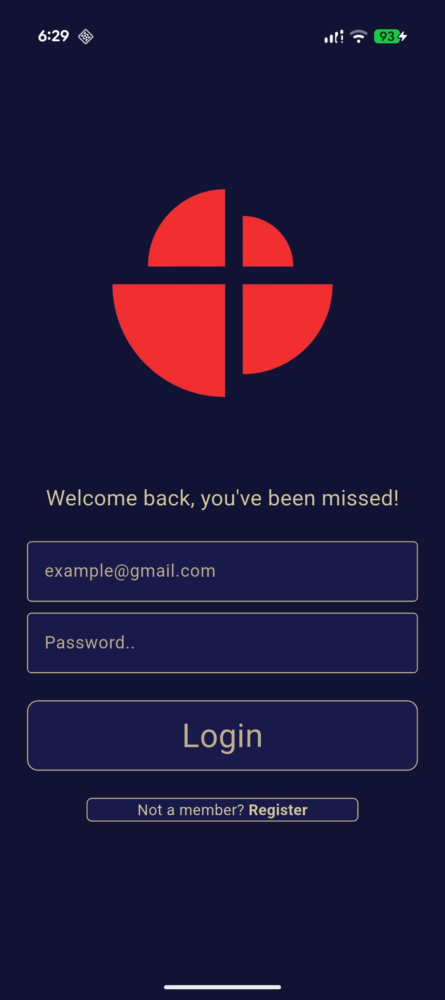
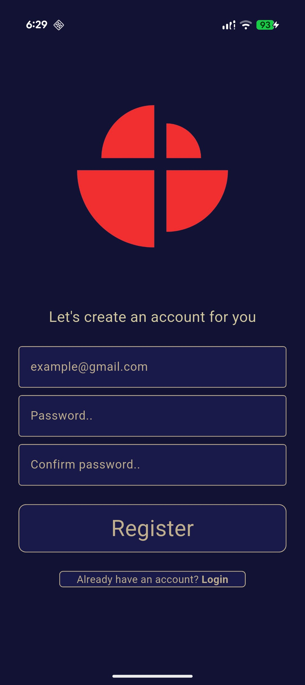
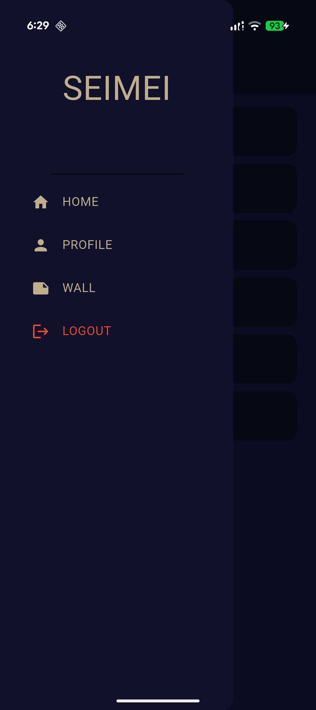
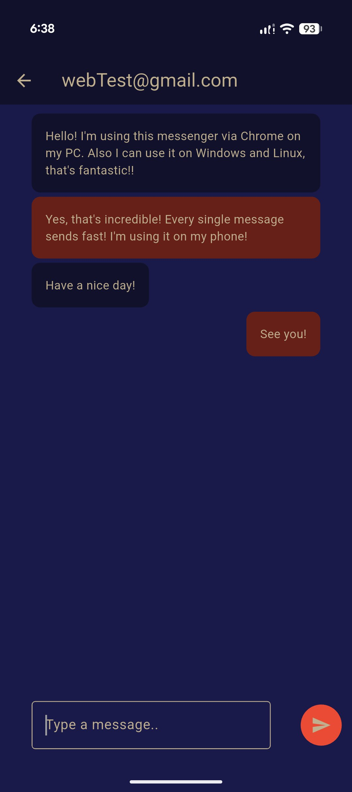
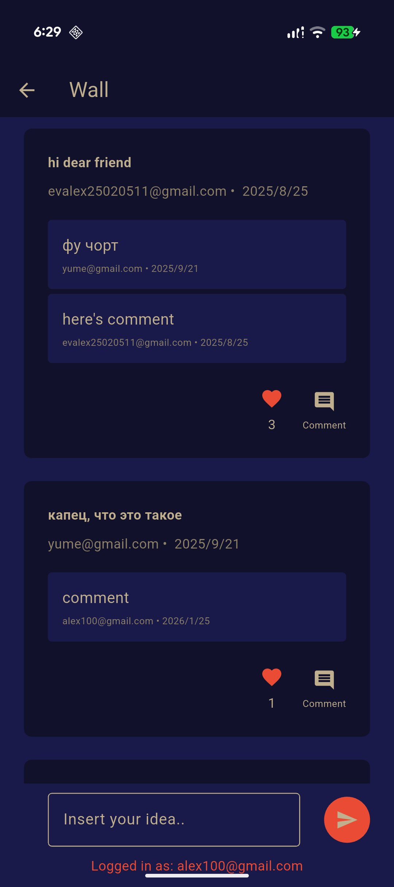
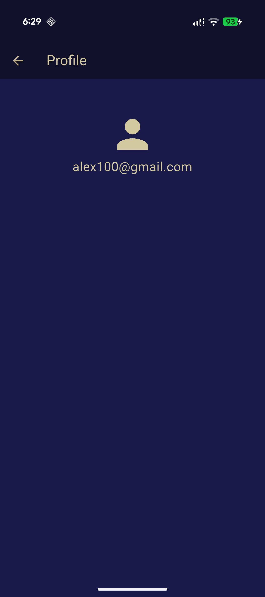

# SEIMEI Messenger 📱💬

**SEIMEI** is a sleek, cross-platform messenger and social hub built with a focus on minimalist **Japanese-style aesthetics** and high performance. Seamlessly switch between private messaging and public interaction on the "Wall."

---

## ✨ Features

- **Real-time Messaging:** Fast and reliable chat powered by Firebase.
- **The Wall:** A community space to post ideas, like content, and leave comments.
- **Japanese Minimalist Design:** A clean, dark-themed UI inspired by modern Japanese digital aesthetics (Seimei / 晴明).
- **Cross-Platform:** Native performance on **Android, iOS, Windows, Linux, and Web (Chrome)**.
- **Authentication:** Secure login and registration system.

---

## 🛠 Tech Stack

- **Frontend:** [Flutter](https://flutter.dev/) & [Dart](https://dart.dev/)
- **Backend:** [Firebase](https://firebase.google.com/) (Firestore, Auth)
- **Architecture:** Clean and responsive UI/UX

---

## 📸 Interface Preview

### 🔑 Getting Started

The onboarding process is simple and elegant, following the minimalist design language.

|              Login Screen              |                 Registration                 |
| :------------------------------------: | :------------------------------------------: |
|  |  |

---

### 💬 Communication & Navigation

A structured user list and an intuitive sidebar for easy navigation between features.

|             User Directory             |           Side Navigation            |            Personal Chat             |
| :------------------------------------: | :----------------------------------: | :----------------------------------: |
|  |  |  |

---

### 📝 Social Experience (The Wall)

The "Wall" allows users to interact through posts and comments, creating a mini-social network inside the app.

|            Community Wall            |                User Profile                |
| :----------------------------------: | :----------------------------------------: |
|  |  |

---

## 🌍 Platform Support

The app is fully optimized for:

- ✅ **Mobile:** Android & iOS
- ✅ **Desktop:** Windows & Linux
- ✅ **Web:** Optimized for Google Chrome

---

_Created by [Your Name/Handle]. SEIMEI — Simple, Elegant, Connected._
